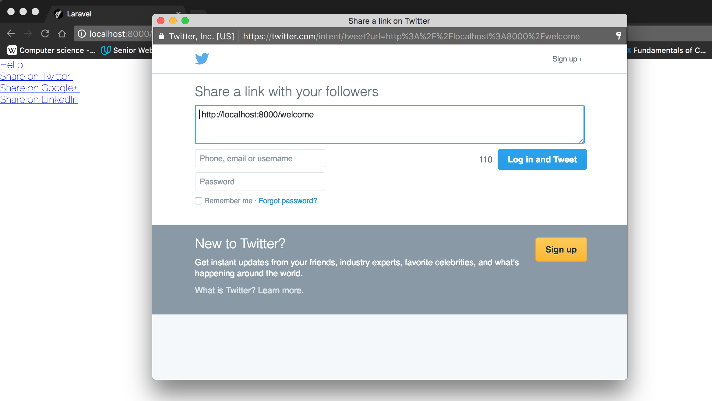

# Customize your Laravel social sharing icons & designs.

Customize your social sharing icons easily. By Default, Package already include Facebook, Google+, LinkedIn, Twitter. But you can add more easily.

## Install
	
Pull package through Composer. Run

	composer require setkyar/laravel-customize-shares

Add service provider within `config/app.php`

    'providers' => [
       SetKyar\CustomShares\CustomSharesProvider::class,
    ];

	
Run the following command for configuration

	php artisan vendor:publish --provider="SetKyar\CustomShares\CustomSharesProvider" --tag="config"

Run the following command for views
	
	php artisan vendor:publish --provider="SetKyar\CustomShares\CustomSharesProvider" --tag="views"

## Usage

To customize your social icons add image with img tag. Customize like the following in `config/shares-config.php`

	'facebook'	=> ''

or add social icon class like the following

	'facebook'	=> '<i class="fa fa-facebook-official"></i>'

You can add one by one social share and can use collection as well.

### One by one example

	<!DOCTYPE html>
	<html lang="en">
	<head>
	    <meta charset="UTF-8">
	    <title>Document</title>
	</head>
	<body>
		@include('share::facebook')
         
        @include('share::twitter')
         
        @include('share::gplus')
         
        @include('share::linkedin')
	</body>
	</html>

### Collection example

	<!DOCTYPE html>
	<html lang="en">
	<head>
	    <meta charset="UTF-8">
	    <title>Document</title>
	</head>
	<body>
		@include('share::social_collection')
	</body>
	</html>

## Add new social

By default, Package already include Facebook, Google+, LinkedIn, Twitter. If you want to add more social media, add new on `resources/views/vendor/customize-share` . You can learn easily by checking other social media. If you want to add default value on config, you can add on `config/shares-config.php`

## Popup (Small new window)

By default, if user click on share. The share link will open in new full window. But if you want to made small new window like the following image

You have to add the following JavaScript code

	
	

## Contributing

 1. Fork it
 2. Create your feature branch (git checkout -b my-new-feature)
 3. Commit your changes (git commit -am 'Added some feature')
 4. Push to the branch (git push origin my-new-feature)
 5. Create new Pull Request

## Security

If you discover any security related issues, please email setkyar16@gmail.com com instead of using the issue tracker.

## Credits

 - [Laravel 5.2 Social Button Tutorials](https://blog.damirmiladinov.com/laravel/laravel-5.2-social-buttons.html)
 - [How to create social share buttons with custom icons](http://petragregorova.com/articles/social-share-buttons-with-custom-icons/)